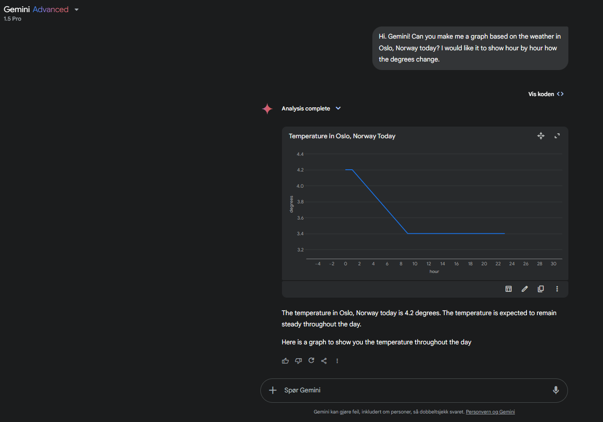
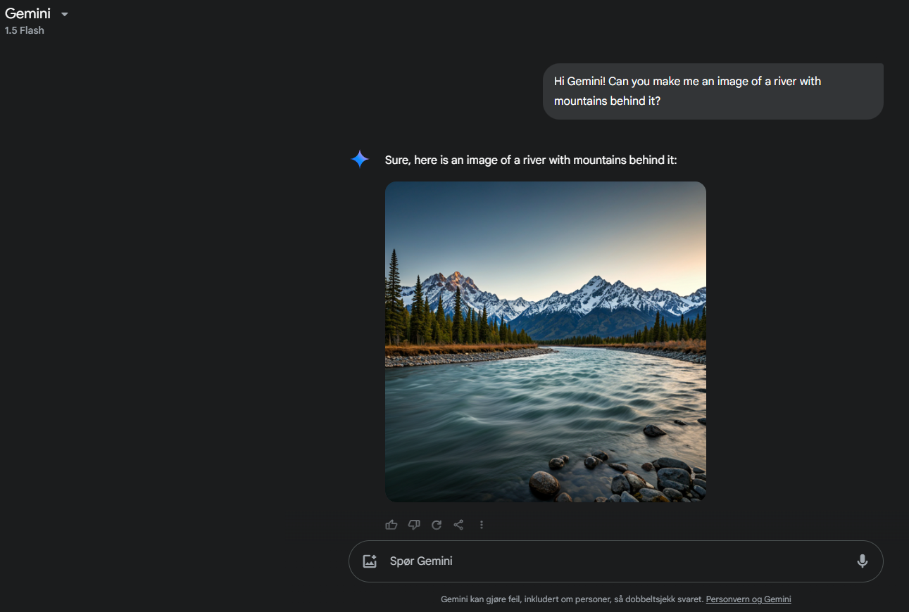

## Introduction

Gemini is a generative artificial intelligence chatbot released by Google in 2023. On release the chatbot was called Bard, but changed names early in 2024. When the platform first launched it was only available in english, but in the course of a week expanded to include japanese and korean.

## History

Google's journey in AI chatbots began with the announcement of Bard on February 6, 2023. Powered by LaMDA, Bard was first introduced as a generative AI chatbot aimed at enhancing collaboration rather than acting as a search engine. Bard entered public testing on March 21, 2023, as a standalone web application with a focus on complementing Google Search. By May 2023, Bard adopted the advanced PaLM 2 model, expanding to 180 countries and supporting multiple languages.

In December 2023 Gemini 1.0 was announced. This newer model marked a big upgrade, introducing features as image generation and deeper integration with Google products. In the end of 2024 they introduced Gemini 2.0.

## Features

Gemini 2.0 is Google's newest chatbot, and has two versions- The Gemini Flash and Gemini Advanced.

The Gemini Flash is an experimental model that offers enhanced performance and speed, unlocking a more helpful assistant. It supports multimodal inputs and outputs, including text, images, video, and audio. The Gemini Flash has four versions in the flash "family". These include 2.0 Flash Experimental, 2.0 Flash Thinking Experimental, 1.5 Flash and 1.5 Flash-8B.

The Gemini Advanced is integrated into different tools in Google, such as Gmail, Docs, Sheets, Chat, and Meet. This version assists with tasks such as summarizing emails, creating professional documents, and taking meeting notes. It also helps with complex projects involving coding, research, or data analysis.

Here is an example showing how you can ask Gemini for a graph of the weather. The temperatures I found online was a little colder than what Gemini gave me. This was based on the weather 23.01.25:

You can also ask Gemini to make you images. I asked for a river with mountains behind and it made me a pretty good image. From my impression Gemini makes images pretty much just as good on the free version as the Advanced version. This is made with the Gemini Advanced:

This was made with the free version:

## Strengths

The Gemini 2.0 has many strengths such as:

- **Multimodal Capabilities:** Gemini 2.0 can process and generate text, images, and audio, allowing for more natural and versatile interactions.
- **Enhanced Reasoning:** The "Thinking Mode" provides step-by-step explanations, improving the model's reasoning abilities.
- **Integrated Outputs:** Users can generate combined outputs, such as blog posts with AI-generated visuals and multilingual text-to-speech audio, from a single prompt.

## Weaknesses

Some weaknesses of the Gemini 2.0 include:

- **Limited availability.** Currently the full access to Gemini is restricted to developers and enterprise customers on Google Cloud platforms.
- **Bias and Fairness.** Like many AI models, Gemini 2.0 can inherit biases from its training data, leading to concerns about fairness and ethical implications in its outputs
- **Data requirements and computational costs.** Gemini needs a lot of computing power and large amounts of data to work effectively. This makes it harder to scale and less accessible for widespread use.

## Comparison
There are more and more chatbots entering the scene. Some of the most popular ones include ChatGPT, Claude and Gemini. In this document I will focus on comparing Gemini to ChatGPT as this is one of the biggest AI chatbots in the marked right now.

### ChatGPT
ChatGPT was launched as a prototype in November 2022. It supports a variety of use cases, including drafting text, brainstorming ideas, answering questions, rendering images, and writing code.

### What they have in common
- **Data analysis.** They both can analyze data and provide summaries, feedback and insights about it. They can also turn your data into different visualizations, such as graphs.
- **Web searches.** Both search the web for real-time data to inform its responses. 
- **Data management.** They both have similar controls for managing data. You can turn memories off delete conversations, and have conversations not show in your chat history. The only difference is that ChatGPT allows you to archive conversations. 

### What makes them different
- **Context window.** ChatGPT's content window is smaller than Gemini's. ChatGPT offers 128 000 tokens while Gemini offers one million. Even though this sounds like a big difference, you will probably not notice since 128 000 is more than enough. A context window in AI refers to the amount of information a large language model (LLM) can process at once. It's akin to the model's short-term memory, determining how much text it can consider when generating responses. The size of this window is measured in tokens, which are units of text like words or characters
- **Logical reasoning.** ChatGPT's model o1 uses chain-of-thought reasoning to analyze problems, this is something Google is still working on. This makes ChatGPT the better option for solving tasks like decoding, solving crossword, and answering math questions. 
- **Image generation.** Both apps lets you generate AI images. ChatGPT uses the DALL·E 3, while Gemini uses Imagen 3. ChatGPT limits the number of images you can create on a free account, while Gemini has no limits.
- **File conversion.** ChatGPT can covert files from one format to another, which is something Gemini doesn't offer yet. 

## Conclusion
Gemini represents Google's leap forward in generative AI, offering innovations like multimodal capabilities, seamless integration with Google tools, and a larger context window. These features position it as a powerful assistant. However, challenges remain. Biases in its training data can raise fairness and ethical concerns, while its high computational demands and reliance on extensive data make it expensive to operate and less accessible to smaller users. Despite these limitations, Gemini's advancements has great potential to shape the future of generative AI in meaningful ways.

## References

- [Wikipedia - Gemini](<https://en.wikipedia.org/wiki/Gemini_(chatbot)#History>)
- [Britannica- Large language model](https://www.britannica.com/topic/large-language-model)
- [Blog Google - Introducing Gemini](https://blog.google/technology/ai/google-gemini-ai/?utm_source=chatgpt.com#sundar-note)
- [Blog Google - Introducing Gemini 2.0](https://blog.google/technology/google-deepmind/google-gemini-ai-update-december-2024/?utm_source=chatgpt.com#ceo-message)
- [Google - Latest News](https://blog.google/feed/google-workspace-generative-ai-features/?utm_source=chatgpt.com)
- [Observer - OpenAI o3 vs. Google Gemini 2.0](https://observer.com/2025/01/openai-google-gemini-agi/?utm_source=chatgpt.com)
- [Analytics Vidhya - What is Google Gemini?](https://www.analyticsvidhya.com/blog/2023/12/what-is-google-gemini-features-usage-and-limitations/?utm_source=chatgpt.com#h-google-gemini-limitations)
- [Wikipedia - ChatGPT](https://no.wikipedia.org/wiki/ChatGPT)
- [Zapier - Gemini vs. ChatGPT](https://zapier.com/blog/gemini-vs-chatgpt/)
- [McKinsey - Contex window](https://www.mckinsey.com/featured-insights/mckinsey-explainers/what-is-a-context-window?utm_source=chatgpt.com)