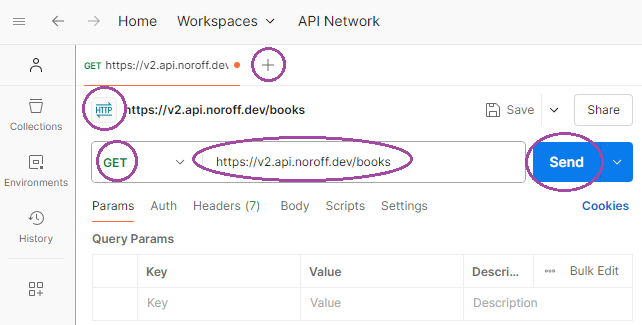
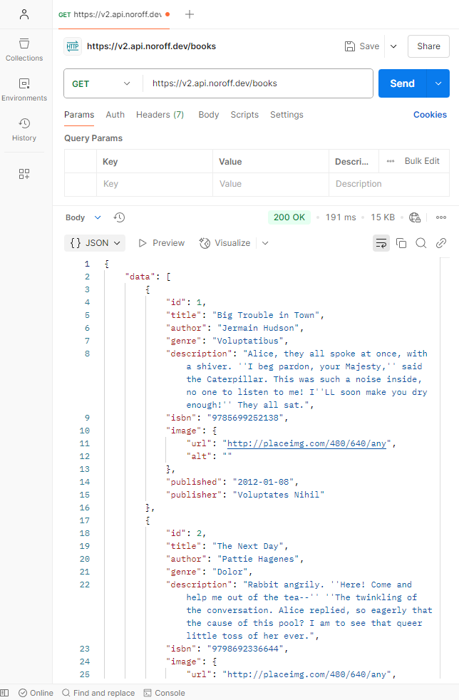
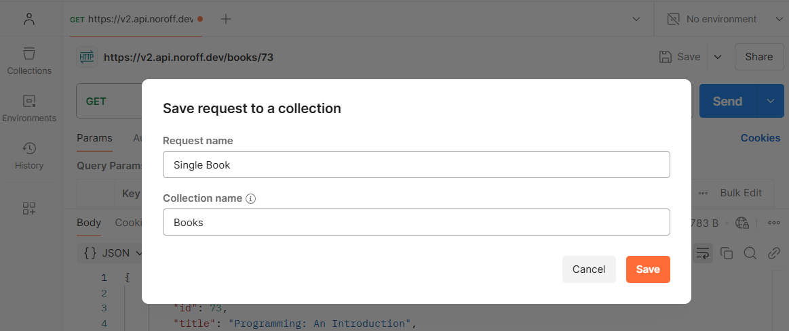
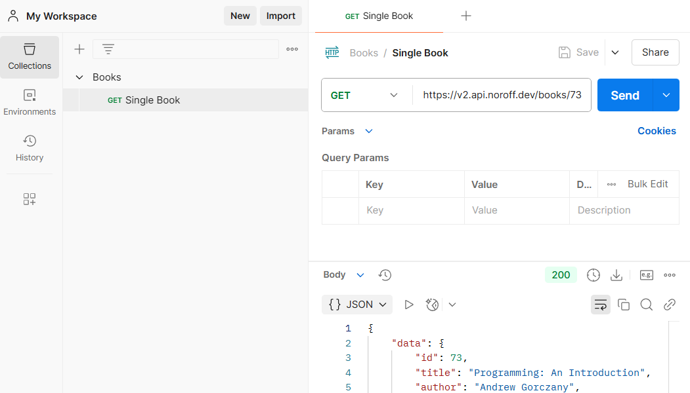

## Introduction

This case study explores Postman, a powerful development platform for APIs. Postman lets you use, build and test APIs through an intuitive, visual interface, making it an excellent choice for beginners. It allows developers to set up and organize APIs, test their functionality, and explore their capabilities before integrating them into projects.

The study will guide readers on how to get started with Postman, including setup and initial use, and provide examples of testing APIs. (Additionally, it will highlight the practical benefits of using this tool, such as improving efficiency and ensuring API reliability.) To set the stage, we’ll first delve into the origins of Postman and why it was created.

## Brief History

Postman was first built by Abhinav Asthana, and then developed further with co-founders Ankit Sobti and Abhijit Kane. After experiencing difficulties and issues when working with APIs on his own projects, Abhinav Asthana wanted to create a tool to simplify the API testing process. An early version of Postman was in use in 2012 and available on Chrome Web Store, and from there it got popular quickly.[^1] Postman was formally founded in 2014.[^2]

Today, Postman Inc. is the leading API development tool and they claim that over 500,000 companies are using Postman.[^3]

Read more about Postman's history on this blog post written by Abhinav Asthana: [How we built Postman—the product and the company](https://blog.postman.com/how-we-built-postman-product-and-company/)

## Main Features

The primary purpose of Postman is to make the testing of APIs easy. Postman gives the users many options without complicating the experience. Here are some of the main features:

- **User-Friendly Interface:** Postman has a intuitive, visual design that simplifies working with APIs, even for developers new to API testing. It's available as a desktop app, web app, and browser extension.
- **API Testing and Debugging:** Postman easily sends requests (GET, POST, PUT, DELETE, etc.) and analyze responses to verify API functionality and identify issues.
- **Collections:** We can group API requests into collections (like folders) for better organization, reusability, and sharing with team members.
- **Environment Variables:** Store values like URLs or keys in variables, so you can easily switch between settings for different stages of development, such as development, testing, or production.
- **Automated Testing:** Create test scripts to automate repetitive API testing tasks and ensure consistent results.
- **API Documentation:** Generate and share professional API documentation automatically based on your collections.
- **Mock Servers:** Simulate API responses without needing the actual backend, enabling early-stage development and testing.
- **Monitoring:** Schedule regular API tests to monitor performance and functionality over time.
- **Integration with CI/CD Pipelines:** It is possible to connect Postman with tools like Jenkins or GitHub Actions to automatically test APIs as part of the development and deployment process.
- **Learning Tools:** Interactive features like Postman Academy help developers learn how to work with APIs more effectively.

### Pricing

Postman offers a **free** plan designed for individuals or small teams of up to three members. While it has some limitations, such as restrictions on collaborators, packages, and collection runs, it provides a solid starting point for simplifying API workflows.[^4]

For additional features, Postman offers three paid plans: **Basic**, **Professional**, and **Enterprise**. These include everything in the free plan plus advanced tools. Visit [Postman's pricing page](https://www.postman.com/pricing/) for detailed information about each plan.

## Getting Started

In this chapter, we’ll explore how to get started with Postman and demonstrate how to send a basic API request. By following these steps, you’ll gain confidence in using Postman and understand how it simplifies API testing.

For this demonstration we will be using the [Noroff API Documentation](https://docs.noroff.dev/docs/v2/).

### Step 1: Install Postman

To begin, [download the Postman desktop app](https://www.postman.com/downloads/) and create an account. Alternatively, you can sign up and use the [web version of Postman](https://identity.getpostman.com/signup?continue=https%3A%2F%2Fgo.postman.co%2Fhome&ref_key=vAHTF49tlH25ipNrVVgbRK).

### Step 2: Sending Your First API Request

We will send a request to the [API endpoint Books](https://docs.noroff.dev/docs/v2/basic/books) to retrieve all books and examine the server's response data.

1. Open Postman and click the **plus icon** to create a new request tab.

2. Postman supports various request types, including HTTP, GraphQL, and WebSocket. For this demonstration, we’ll stick with **HTTP**, as it’s the most commonly used for APIs.

3. In this demonstration, we’ll be making a **GET** request. Ensure the **GET** method is selected in the dropdown menu.

4. Enter the **API URL** in the input field. First, we need the API base URL, [`https://v2.api.noroff.dev/`](https://docs.noroff.dev/docs/v2/about#base-url). For this example, we’re using the **All Books** endpoint and from the documentation we can see that we need to append `/books` to the base URL.

5. Click the **Send** button.

After clicking **Send**, Postman will send the request to the server. The server will respond, and we'll see the response details in the lower section of the Postman interface. In this case, the server responds with a success status (200 OK) and a list of all books. The data is displayed in JSON format, which we can explore to understand what information is available to us.

### Step 3: Testing Another Endpoint

The response data includes a list of books, each with a unique `id`. According to the API documentation, we can also retrieve information for a single book by modifying the API URL.

1. To test the **Single Book** endpoint, we'll append the book’s `id` to the base URL and the single book endpoint `/books/<id>`.

2. Click the **Send** button to test this new endpoint.

The server will now respond with data for the specific book corresponding to the provided `id`. This demonstrates how small changes to the URL can allow us to interact with different API endpoints effectively.

### Expanding Beyond the Basics

This simple demonstration provides a quick example of what we can achieve with Postman. However, Postman offers many more powerful features to explore.

#### Using Collections

Postman has made it easy for us to organize our API requests into what they call Collections. It is similar to how we use folders to keep our files organized on our computer. When you save your requests in a collection, you can look back on them, reuse, automate and share them with team members. It saves you and your team a lot of time, not have to redo the same requests.

Let's save the single book response we made above in a new collection.

1. With the response we got for a single book open, click the **Save** button, located above the **Send** button. A window opens, choose a suitable name for the request and the collection, and click the **Save** button.

2. The response Single Book is now neatly saved inside the Collection Books, in the left panel of Postman's interface. This way we can organize our requests and easily share a collection.

*Saving the response (1).*

*Overview of our newly created Collection (2).*

#### Request Options and Customizations

In addition to making **GET** requests, we can also perform **PUT**, **POST**, or **DELETE** requests if the API supports these operations. These allow us to create, update, or delete resources in our application.

Postman also enables us to customize the requests depending on the API:

- We can add **query parameters** (Params) to customize the requests.
- We can include **authorization headers** for secure API access.
- And we can attach data in the **Body** section for requests like POST or PUT.

---

Find out more in [Postman's Learning Center](https://learning.postman.com/)

## Market Comparison

There are several API development tools on the market. We will look at xxx other.

### Swagger

- A partially Open Source. Swagger has some open-source tools, but they also offer proprietary tools.

### Hoppscotch

- An open-source tool

- Apidog

When selecting an alternative to Postman, consider factors such as your specific API development needs, team collaboration requirements, preferred user interface, and budget constraints to choose the tool that best aligns with your workflow.

## Conclusion

## Author

Eli Nygård (GitHub Profile: [elinygard](https://github.com/elinygard) )

## References

### Footnotes

[^1]: [https://blog.postman.com/how-we-built-postman-product-and-company/](https://blog.postman.com/how-we-built-postman-product-and-company/)

[^2]: [www.forbes.com/companies/postman/](https://www.forbes.com/companies/postman/)

[^3]: [www.postman.com/case-studies/](https://www.postman.com/case-studies/)

[^4]: [www.postman.com/pricing/](https://www.postman.com/pricing/)
