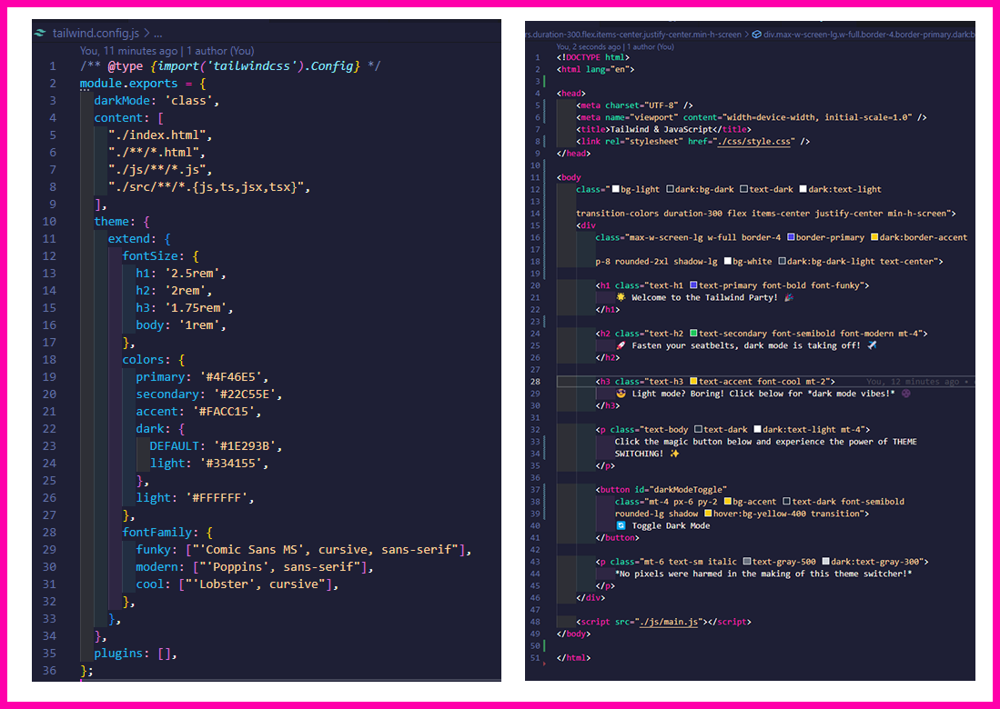
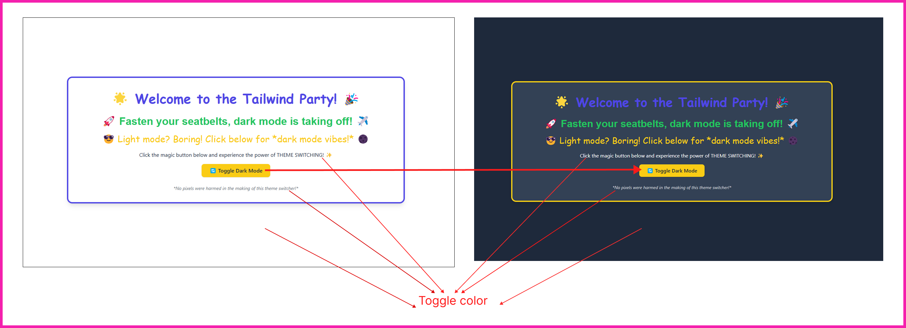
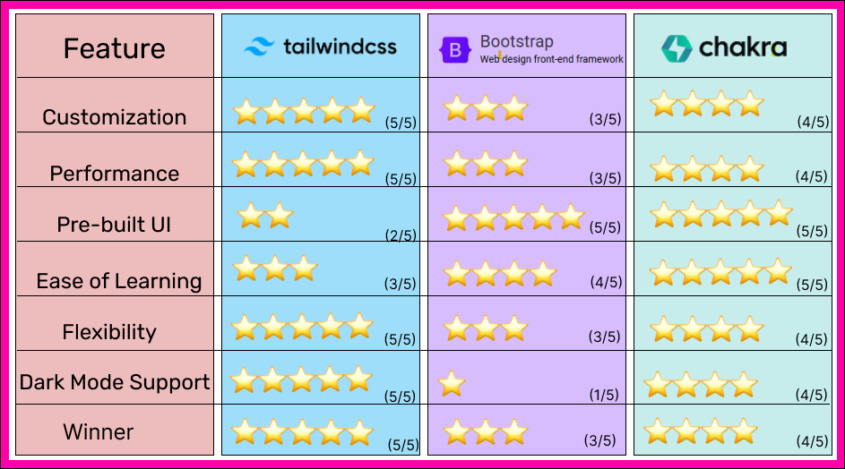

---

title: "Advanced Tailwind CSS Customization & Theming"
author: "Sana Khuram"
tags: ["Tailwind CSS", "Customization", "Theming", "Dark Mode", "UI Components"]
---

# **Advanced Tailwind CSS Customization & Theming**


## **1. Introduction**
Tailwind CSS is a powerful utility-first CSS framework that allows developers to build modern and responsive user interfaces quickly. While its default settings offer great flexibility, many teams and projects benefit from customizing Tailwind to match their **design systems, branding, and theming requirements**.

This case study explores **advanced customization techniques**, including:
- Setting up a **custom Tailwind configuration (`tailwind.config.js`)**  
- Creating a **design system** with **custom fonts, colors, and spacing**  
- Enabling **dark mode & theme switching**  
- Building **reusable UI components**  
- Exploring **Tailwind CSS Plus** for advanced features  

## **2. Brief History of Tailwind CSS**
- 2017: Adam Wathan releases Tailwind CSS as a utility-first framework.
- 2019: Tailwind CSS gains popularity with Tailwind UI release.
- 2021: Tailwind CSS v3 introduces JIT (Just-In-Time) mode for faster builds.
- 2023: Tailwind becomes one of the most widely used CSS frameworks.

---

## **3. Tailwind Configuration & Customization**
Tailwind CSS allows extensive customization through its `tailwind.config.js` file. This file lets you extend and override the default styles to create a consistent design system.

```js
module.exports = {
  darkMode: 'class', // Enables manual dark mode switching
  theme: {
    extend: {
      fontSize: {
        h1: '2.5rem',
        h2: '2rem',
        h3: '1.75rem',
        body: '1rem',
      },
      colors: {
        primary: '#4F46E5',
        secondary: '#22C55E',
        accent: '#FACC15',
        dark: {
          DEFAULT: '#1E293B',
          light: '#334155',
        },
        light: '#FFFFFF',
      },
    },
  },
};
```

This setup ensures that developers can use predefined styles like `text-h1` or `bg-primary` for consistency across the project.

---

## Common Tailwind CSS Mistakes & How to Fix Them

### ❌ Mistake: Not Enabling JIT Mode  
Without JIT mode, Tailwind generates **larger CSS files** containing unused classes.

✅ **Solution:** Ensure that `mode: 'jit'` is set in `tailwind.config.js`:
```js
module.exports = {
  mode: 'jit',
  purge: ["./index.html", "./src/**/*.js"],
};
```
 
---

## **4. Implementing Dark Mode & Live Demo**



Tailwind supports **dark mode**, which can be enabled in two ways:
1. `media` (System preference-based dark mode)
2. `class` (Manual toggle-based dark mode)

```html
<div class="bg-light dark:bg-dark text-dark dark:text-light p-6">
  This text adapts to light and dark mode.
</div>
```

**JavaScript for Dark Mode Toggle:**
```js
const toggleDarkMode = () => {
  document.documentElement.classList.toggle('dark');
};
```


---

## **5. Tailwind CSS Plus: Enhancing Development Efficiency**
### **What is Tailwind CSS Plus?**
Tailwind CSS Plus is a **premium subscription service** offered by Tailwind Labs. It provides advanced tools, pre-built UI components, and workflow integrations designed to help developers build faster and more efficiently.

### **Key Features of Tailwind CSS Plus**
- **Tailwind UI Pro** – A collection of professionally designed UI components and templates.
- **Figma Integration** – Direct design-to-code workflow with Tailwind UI Figma kits.
- **Advanced Plugins** – Includes premium Tailwind CSS plugins for typography, animations, and gradients.
- **AI-Powered Code Suggestions** – Smart design recommendations to speed up development.

### **Tailwind CSS (Free) vs. Tailwind CSS Plus (Premium)**
| Feature | Tailwind CSS (Free) | Tailwind CSS Plus |
|---------|--------------------|------------------|
| **Utility-First CSS Framework** | ✅ Yes | ✅ Yes |
| **Customizable Theme (`tailwind.config.js`)** | ✅ Yes | ✅ Yes |
| **Pre-Built UI Components** | ❌ No | ✅ Yes |
| **Figma Design Integration** | ❌ No | ✅ Yes |
| **Advanced Plugins (Typography, Forms, etc.)** | ❌ No | ✅ Yes |
| **AI-Powered Code Suggestions** | ❌ No | ✅ Yes |
| **Pricing** | Free | Paid Subscription |

---

## **6. Real-World Usage: Companies Using Tailwind CSS**
Many popular companies use Tailwind CSS for their applications:
- **GitHub** – Uses Tailwind in certain UI elements.
- **Vercel** – Fully supports Tailwind CSS for Next.js apps.
- **Laravel** – Default styling for Laravel Jetstream.
- **Hashnode** – A blogging platform built using Tailwind CSS.

> *"Laravel officially recommends Tailwind CSS for styling in Laravel Jetstream. This demonstrates how Tailwind is being adopted in production applications for scalability and maintainability."*

---
## **Market Comparison**
### **How does Tailwind CSS compare to Bootstrap & Chakra UI?**



### **Why Choose Tailwind?**
✅ More **flexible** than Bootstrap  
✅ More **customizable** than Chakra UI  
✅ **Lightweight & scalable** for modern applications  

---

## **7. Future Features & Roadmap**
- **Upcoming Tailwind CSS Features**: Check the [GitHub Issues](https://github.com/tailwindlabs/tailwindcss/issues) for new updates.
- **AI-powered Design**: Speculative features like AI-based code suggestions.
- **Better Integrations**: Enhancements for React Native and cross-platform UI frameworks.

---

## **8. Tailwind CSS in Popular Frameworks**
### **Next.js + Tailwind CSS**
- Automatic CSS purging for smaller file sizes.
- Optimized for server-side rendering.

### **React + Tailwind CSS**
- Component-based styling with utility classes.
- Faster UI development with reusable components.

### **Vue.js + Tailwind CSS**
- Vue directives for dynamic class binding.
- Improved maintainability with Tailwind’s design system.

---

## **9. Common Mistakes & How to Avoid Them**
❌ **Misconfiguring `tailwind.config.js`** – Ensure extensions are properly defined.
❌ **Not Enabling JIT Mode** – Without JIT, unnecessary styles may be generated.
❌ **Overusing `@apply`** – Can lead to bloated CSS files; use sparingly.

---

## **10. Conclusion & Future Outlook**
✔ Ensures **branding consistency** in large projects.  
✔ Enables **scalable UI development**.  
✔ **Dark mode** improves accessibility.  
✔ **Tailwind CSS Plus** speeds up enterprise-grade development.  

### **Future Trends in Tailwind CSS**
🚀 **AI-Powered Tailwind** – AI-assisted code suggestions in Tailwind CSS Plus.  
🔧 **Improved Figma/Webflow integrations** – Bridging design-to-code workflows.  
📈 **More adoption in enterprise applications** – Companies moving from Bootstrap to Tailwind.  

---

## **References & Additional Resources**
📌 [Tailwind CSS Official Documentation](https://tailwindcss.com/docs/)  
📌 [Tailwind CSS GitHub Repository](https://github.com/tailwindlabs/tailwindcss)  
📌 [Bootstrap vs. Tailwind: A Performance Comparison](https://www.sitepoint.com/tailwind-vs-bootstrap/)  
🎥 [Tailwind CSS Full Course (YouTube)](https://www.youtube.com/watch?v=dFgzHOX84xQ)  

### **💻 Live Demo:**
🔗 **[View Live](https://codepen.io/skhm/pen/mybmexV)**
