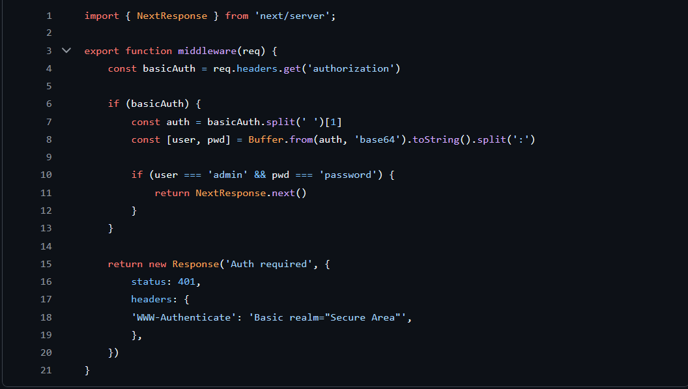

## Introduction

Vercel Edge Middleware provides developers with the ability to run code before a request is completed, enabling powerful use cases like authentication, bot protection, redirects, and rewriting requests. This technology runs at the edge of the network, closest to your users, making it crucial for performance and security in modern web applications.

## Brief History

- 2021: Initial beta release of Edge Middleware
- 2022: Edge Middleware becomes generally available
- 2022: Introduction of advanced matching patterns for middleware
- 2023: Enhanced middleware capabilities with improved routing
- 2024: Integration with advanced analytics and monitoring

## Main Features

- **Request Interception:** Vercel Edge Middleware allows developers to intercept and modify incoming HTTP requests before they reach the application. This enables powerful use cases like authentication, bot protection, redirects, and request rewriting.
- **Serverless Execution:** Edge Middleware functions are executed at the edge of Vercel's network, closest to the user, providing low-latency and high-performance request handling.

- **Flexible Matching:** Middleware functions can be selectively executed based on detailed request matching patterns, such as URL path, query parameters, headers, and more.

- **Integrated Analytics:** Edge Middleware functions have access to detailed analytics and monitoring, allowing developers to gain insights into request patterns and middleware performance.

- **Language Agnostic:** Middleware functions can be written in various languages supported by Vercel, including JavaScript, TypeScript, Go, and Rust.

## Market Comparison

In comparing Vercel Edge Middleware to other tools on the market, I decided to focus on Netlify Edge Functions as it's a widely accessible alternative that many developers, including myself, have come across in web projects. While there are other great tools like Cloudflare Workers and AWS Lambda@Edge available, Netlify provides a more direct comparison since it targets similar use cases and developer experiences.

### Key Differentiators

Vercel Edge Middleware:

- Superior Next.js integration
- Advanced server-side rendering capabilities
- Intelligent edge caching
- Real-time analytics and monitoring
- Optimized for dynamic content

Netlify Edge Functions:

- More flexible deployment options
- Better handling of large media files
- Built-in A/B testing capabilities
- Stronger static site optimization
- Better documentation
- Simpler to learn

Vercel Edge Middleware shows great strength in server-side functionality, especially when working with Next.js applications. Its edge functions run at the CDN level, and operates closer to the user and improves response times. Netlify, on the other hand, leverages a global multi-cloud Edge network that fits well for a static site, it offers more flexible memory and assures the most recent deployment of the web site is available.

Netlify Edge Functions offers many similar capabilities to Vercel Edge Middleware, but there are some key differences. One significant advantage of Vercel's solution is its integration with Next.js projects.
However, Netlify have some great features like built-in A/B testing and is generally easier to learn if you are new to edge computing.

The choice between these two often comes down to your specific project needs. I've found Vercel Edge Middleware to be the better choice for projects requiring sophisticated server-side rendering and real-time data handling. However, for projects focused on static content delivery or if you require more flexible deployment configurations, Netlify Edge Functions might be the better option.

## Getting Started

To get started with Vercel Edge Middleware:

1. **Create a Middleware File**: In your Vercel project, create a new file named `middleware.ts` (or `middleware.js` for JavaScript) in the root directory.
2. **Define Your Middleware Function**: In the middleware file, export a function that will handle the request processing. For example :
   

Image source: Code example from tumetus/nextjs-middleware-example

3. **Configure Middleware Matching**: In your Vercel project settings, navigate to the "Edge Functions" section and configure the matching rules for your middleware function.
4. **Deploy Your Project**: Deploy your Vercel project, and your middleware function will start executing at the edge for incoming requests that match the configured rules.

## Conclusion

This section can be used to summarize your findings. What are the main advantages and disadvantages of your chosen tool? What are the main use cases for this tool? What are the main limitations of this tool? What does the future look like for this tool?

## References

- [Edge Middleware overview](https://vercel.com/docs/functions/edge-middleware)
- [Next.js Middleware Tutorial - Getting Started With Middleware](https://www.youtube.com/watch?v=NlBSheYPKkg)
- [Next.js Middleware Example Repository](https://github.com/tumetus/nextjs-middleware-example)
- [Netlify vs Vercel - Which Is Better For Your Next Project?](https://www.evolvingdev.com/post/netlify-vs-vercel)

## Additional Resources
